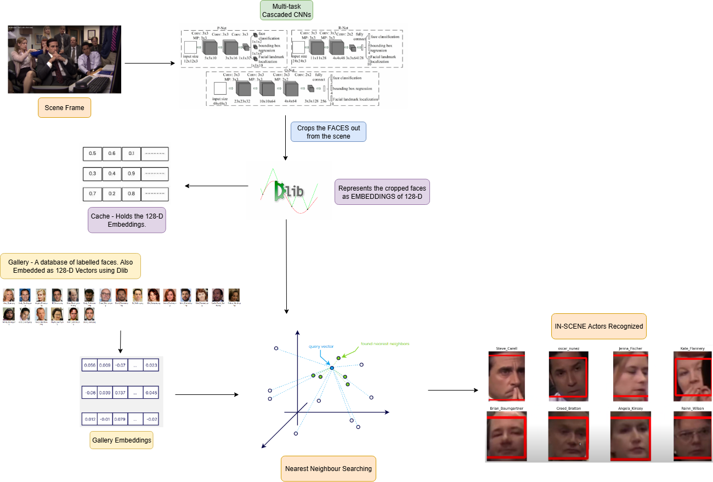

# 🎥🍿InScene_ver1 A LightWeight FRPipeline for In-Scene🎞️ Actor Recognition🤔
This repo presents a lightweight face recognition pipeline which can be (in movies and TV shows) in the wild. This work is inspired by the **"X-Ray"** feature on **Amazon Prime video** which gives the viewer - the name and the profile of **all highlighted actors** in a scene when the **pause button** is pressed.

# Demo 👇
<video src="demo.mp4" controls width="640"></video>
[[Link to Demo]](https://youtu.be/8GYcTioPrIA "Click to watch")

# Overview of the pipeline


## 🚀 Features

* **MTCNN-based face crop extraction**: Accurate multi-scale face extraction **In the Wild!**
* **Dlib embeddings**: **128D face feature vectors** for robust recognition.
* **Actor recognition**: Match faces against a pre-registered set of actors to output the identities of all **highlighted actors** present in a scene.
---

## 📂 Project Structure

```bash
.
├── bbt_gallery/       # Registered gallery of actors from the show - "The Big Bang Theory".
├── bbt_test_images/          # Some test scenes from the show - "The Big Bang Theory" to be supplied for inference.
├── office_gallery/    # Registered gallery of actors from the show - "The Office".
├── office_test_images/       # Some test scenes from the show - "The Office" to be supplied for inference.
├── requirements.txt      # Python dependencies.
├── get_gallery_embeddings.ipynb     # To generate embeddings for the pre-registered gallery of actors.
├── crop_recog_persistant_inf.ipynb  # Runs the entire inference pipeline i.e. supply test image --> faces get detected and cropped --> Embeddings get generated and matched with the cached gallery embeddings.
├── demo.py            # A Streamlit demo of the entire project.
├── my_dlib_funcs.py   # Some utility functions for embeddings generation and caching.
├── gallery_embeddings.pkl   # Embedding cache represented as a pickle file.
├── requirements.txt   # Project dependencies
├── dlib-19.24.99-cp313-cp313-win_amd64.whl   # dlib wheel for python3.13
```

---

## 🔧 Running Dependency

Download **shape-predictor-68-face-landmarks.dat** from the link [[Link to Demo]]((https://www.kaggle.com/datasets/sergiovirahonda/shape-predictor-68-face-landmarksdat))

   ```bash
   git clone https://github.com/yourusername/in-scene-actor-recognition.git
   cd in-scene-actor-recognition
   ```

## 📜 License

This project is licensed under the [MIT License](LICENSE).

---

## 🙌 Acknowledgements

* [MTCNN](https://kpzhang93.github.io/MTCNN_face_detection_alignment/) for face detection
* [Dlib](http://dlib.net/) for face recognition embeddings
  
---

### ⭐ If you find this project helpful, don’t forget to star the repo!


